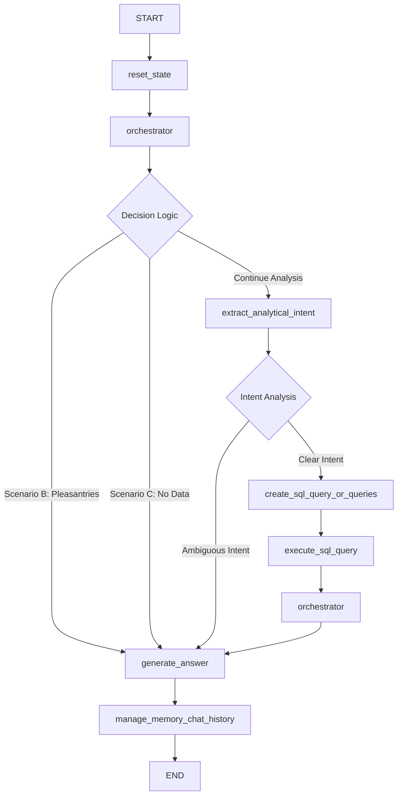

# Technical Documentation Detailed

### LangGraph Agent Workflow



## Graph Architecture

### LangGraph State Diagram

```
┌─────────────────────────────────────────────────────────────────────┐
│                     db_agent_v2 LangGraph Flow                     │
└─────────────────────────────────────────────────────────────────────┘

    [START] 
       │
       ▼
  ┌──────────┐
  │reset_state│
  └─────┬────┘
        │
        ▼
  ┌─────────────┐
  │orchestrator │◄─────────┐
  └─────┬───────┘          │
        │                  │
        ▼                  │
   ┌─────────┐             │
   │Decision │             │
   │ Logic   │             │
   └─┬─┬─┬───┘             │
     │ │ │                 │
     │ │ └─Continue────────────┐
     │ │                      │
     │ └─Scenario B/C          │
     │   (Pleasantries/        │
     │    No Data)             │
     │                         │
     ▼                         ▼
┌──────────────┐    ┌─────────────────────┐
│generate_answer│    │extract_analytical   │
│              │    │_intent              │
│(End Flow)    │    └─────────┬───────────┘
└──────────────┘              │
                               ▼
                          ┌─────────┐
                          │Decision │
                          │ Logic   │
                          └─┬───┬───┘
                            │   │
                            │   └─Ambiguous──┐
                            │                │
                            └─Clear          │
                                             │
                                             ▼
                             ┌─────────────────────┐
                             │generate_answer      │
                             │(Ambiguous Response) │
                             │(End Flow)           │
                             └─────────────────────┘
                                             
                    ┌─────────────────────┐
                    │create_sql_query_or  │
                    │_queries             │
                    └─────────┬───────────┘
                              │
                              │ (automatic)
                              ▼
                    ┌─────────────────────┐
                    │execute_sql_query    │
                    │(function call)      │
                    └─────────┬───────────┘
                              │
                              ▼ (for each query)
                    ┌─────────────────────┐
                    │   Error Check?      │
                    │                     │
                    └─┬─────────────────┬─┘
                      │                 │
                      │ Error           │ Success
                      ▼                 │
            ┌─────────────────────┐     │
            │correct_syntax_sql   │     │
            │_query (up to 3x)    │     │
            └─────────┬───────────┘     │
                      │                 │
                      └─────────────────┘
                              │
                              ▼
                    ┌─────────────────────┐
                    │   Token Check       │
                    │check_if_exceed_max  │
                    │_context_limit       │
                    └─┬─────────────────┬─┘
                      │                 │
                      │ Exceeds         │ Within Limit
                      ▼                 │
            ┌─────────────────────┐     │
            │refine_sql_query     │     │
            │(optimization)       │     │
            └─────────┬───────────┘     │
                      │                 │
                      └─────────────────┘
                              │
                              ▼
                    ┌─────────────────────┐
                    │create_query_analysis│
                    │+ extract_metadata   │
                    │_from_sql_query      │
                    └─────────┬───────────┘
                              │
                              ▼
                    ┌─────────────────────┐
                    │orchestrator         │ (2nd run)
                    │(routes to           │
                    │ generate_answer)    │
                    └─────────┬───────────┘
                              │
                              ▼
                    ┌─────────────────────┐
                    │generate_answer      │
                    │(Data Insights)      │
                    │                     │
                    └─────────┬───────────┘
                              │ (automatic)
                              ▼
                    ┌─────────────────────┐
                    │manage_memory_chat   │
                    │_history             │
                    │(function call)      │
                    └─────────┬───────────┘
                              │
                              ▼
                            [END]
```

### Tools vs Functions

**LangChain Tools (@tool decorated):**
- `extract_analytical_intent` - Intent analysis and ambiguity detection
- `create_sql_query_or_queries` - SQL query generation from analytical intents  
- `generate_answer` - Final response generation based on scenario

**Core Functions (in state diagram):**
- `reset_state` - State initialization at graph start
- `orchestrator` - Central routing logic and decision making
- `run_control_flow` - Tool execution controller
- `execute_sql_query` - SQL execution with error handling and optimization
- `manage_memory_chat_history` - Memory management and token optimization
- `router` - Routing logic for conditional edges

**Error Handling & Optimization Functions (in state diagram):**
- `correct_syntax_sql_query` - Automatic SQL error correction
- `refine_sql_query` - Query optimization for token limits
- `check_if_exceed_maximum_context_limit` - Token limit validation
- `create_query_analysis` - Query result analysis and insights
- `extract_metadata_from_sql_query` - SQL structure parsing

## State Schema

The central state management system that maintains all context throughout the conversation:

```python
class State(TypedDict):
    """
    Central state management for the agent workflow.
    Maintains all necessary context throughout the conversation.
    """
    objects_documentation: str                    # Database schema information from metadata
    database_content: str                        # Database content summary with column values
    sql_dialect: str                             # SQL dialect
    messages_log: Sequence[BaseMessage]          # Conversation history with HumanMessage/AIMessage pairs
    intermediate_steps: list[AgentAction]        # Agent processing steps for orchestration tracking
    analytical_intent: list[str]                # Extracted analytical requirements (1-5 intents)
    current_question: str                        # Current user query being processed
    current_sql_queries: list[dict]             # Generated SQL queries with results and metadata
    generate_answer_details: dict               # Answer generation metadata and scenario info
    llm_answer: BaseMessage                      # Final AI response message
```

### State Data Examples

**Example objects_documentation:**
```
Table public.advisors: Financial advisors with historical tracking (SCD Type 2) Columns:
    advisor_key: Unique surrogate key (PRIMARY KEY)
    advisor_id: Natural business identifier for the advisor
    firm_name: Name of the firm the advisor is part of (NOT Capital Partners)
    firm_affiliation_model: Business model of the advisor firm (RIA, Hybrid RIA, Broker-Dealer, etc.)

Table public.business_line: Investment product service lines offered by Capital Partners to advisors Columns:
    business_line_key: Unique identifier for Capital Partners business line (PRIMARY KEY)
    business_line_name: Capital Partners product service category (Managed Portfolio, SMA, Mutual Fund Wrap, Annuity, Cash)
```

**Example current_sql_queries structure:**
```python
[
    {
        'query': 'SELECT firm_name, SUM(net_revenue) as total_revenue FROM fact_revenue_monthly f JOIN advisors a ON f.advisor_key = a.advisor_key GROUP BY firm_name ORDER BY total_revenue DESC LIMIT 10',
        'explanation': 'Top 10 advisor firms by total revenue',
        'result': 'firm_name    total_revenue\nOak Wealth   245000.00\nSmith Financial  198000.00\n...',
        'insight': 'Oak Wealth generates the highest revenue at $245,000, followed by Smith Financial at $198,000',
        'metadata': '🧊 Tables: • fact_revenue_monthly • advisors\n🧮 Aggregations: • SUM(net_revenue)\n📦 Groupings: • firm_name'
    }
]
```

## Tools & Functions

### LangChain Tools (@tool decorated)

#### 1. extract_analytical_intent(state: State) → State

**Tool Name:** `extract_analytical_intent`  
**Purpose:** Determines if user question is clear or ambiguous and generates analytical intents.

**Process Flow:**
1. **Ambiguity Detection** → Analyze question against database schema
2. **Clear Path** → Generate single analytical intent
3. **Ambiguous Path** → Generate multiple analytical intents + explanatory notes

**Input Variables to Prompt Templates:**

**Prompt 1 - Ambiguity Detection:**
```python
{
    'objects_documentation': state['objects_documentation'],
    'question': state['current_question'], 
    'messages_log': extract_msg_content_from_history(state['messages_log'])
}
```

**If/Else Flow:**
```python
if result_1['analytical_intent_clearness'] == "Analytical Intent Extracted":
    next_tool = 'create_sql_query_or_queries'
    scenario = 'A'
elif result_1['analytical_intent_clearness'] == "Analytical Intent Ambiguous":
    next_tool = 'generate_answer'
    scenario = 'D'
```

---

#### 2. create_sql_query_or_queries(state: State) → State

**Tool Name:** `create_sql_query_or_queries`  
**Purpose:** Converts analytical intents into executable SQL queries.

**Input Variables to Prompt Template:**
```python
{
    'objects_documentation': state['objects_documentation'],
    'database_content': state['database_content'], 
    'analytical_intent': state['analytical_intent'],
    'sql_dialect': state['sql_dialect']
}
```

**Multi-step Intent Handling:**
- **Simple Intent** → Single SQL query
- **Multi-step Intent** (contains "Step 1:", "Step 2:") → CTE-based complex query

---

#### 3. generate_answer(state: State) → State

**Tool Name:** `generate_answer`  
**Purpose:** Generates final AI response based on scenario and available data.

**Scenario-Based Answer Generation:**
- **Scenario A** - Data Insights  
- **Scenario B** - Conversational responses
- **Scenario D** - Ambiguous question clarification

---

### Core Functions (from state diagram)

#### 4. reset_state(state: State) → State

**Function Name:** `reset_state`  
**Purpose:** State initialization at graph start.

---

#### 5. orchestrator(state: State) → State

**Function Name:** `orchestrator`  
**Purpose:** Central routing logic and decision making.

**If/Else Flow:**
```python
if result['next_step'] == 'Continue':
    next_tool_name = get_next_tool(state)  # → extract_analytical_intent
elif result['next_step'] == 'B':
    next_tool_name = 'generate_answer'  # Pleasantries/Already answered
elif result['next_step'] == 'C':
    next_tool_name = 'generate_answer'  # Data not available
```

---

#### 6. run_control_flow(state: State) → State

**Function Name:** `run_control_flow`  
**Purpose:** Tool execution controller.

```python
def run_control_flow(state: State) → State:
    tool_name = state['intermediate_steps'][-1].tool
    
    if tool_name == 'extract_analytical_intent':
        state = extract_analytical_intent.invoke({'state': state})
    elif tool_name == 'create_sql_query_or_queries':
        state = create_sql_query_or_queries.invoke({'state': state})
        execute_sql_query(state)  # Automatic execution
    elif tool_name == 'generate_answer':
        state = generate_answer.invoke({'state': state})
        manage_memory_chat_history(state)  # Automatic memory management
    
    return state
```

---

#### 7. execute_sql_query(state: State) → State

**Function Name:** `execute_sql_query`  
**Purpose:** SQL execution with error handling and optimization.

**Process:**
1. **Execute Query** → Using PostgreSQL connection
2. **Error Handling** → Up to 3 correction attempts via `correct_syntax_sql_query`
3. **Token Check** → Refine if result too large via `refine_sql_query`
4. **Analysis** → Generate insights via `create_query_analysis` + `extract_metadata_from_sql_query`

---

#### 8. manage_memory_chat_history(state: State) → State

**Function Name:** `manage_memory_chat_history`  
**Purpose:** Memory management and token optimization.

**Logic:**
```python
tokens_chat_history = calculate_chat_history_tokens(state['messages_log'])

if tokens_chat_history >= 1000 and len(state['messages_log']) > 4:
    # Keep last 4 messages, summarize older ones
    message_history_to_summarize = state['messages_log'][:-4]
    summary = llm_fast.invoke({'message_history_to_summarize': message_history_to_summarize})
    state['messages_log'] = [summary] + state['messages_log'][-4:]
```

---

#### 9. router(state: State) → str

**Function Name:** `router`  
**Purpose:** Routing logic for conditional edges.

---

### Error Handling & Optimization Functions (from state diagram)

#### 10. correct_syntax_sql_query(sql_query: str, error: str, ...) → str

**Function Name:** `correct_syntax_sql_query`  
**Purpose:** Automatic SQL error correction.  
**Used by:** `execute_sql_query` (up to 3 attempts)

---

#### 11. refine_sql_query(analytical_intent: str, sql_query: str, ...) → str

**Function Name:** `refine_sql_query`  
**Purpose:** Query optimization for token limits.  
**Used by:** `execute_sql_query` when token limit exceeded

---

#### 12. check_if_exceed_maximum_context_limit(sql_query_result: str) → bool

**Function Name:** `check_if_exceed_maximum_context_limit`  
**Purpose:** Token limit validation.  
**Used by:** `execute_sql_query` to determine if refinement needed

## Helper Functions

#### 1. extract_msg_content_from_history(messages_log: list) → str

**Function Name:** `extract_msg_content_from_history`  
**Purpose:** Extracts content from LangChain BaseMessage objects for prompt formatting.  
**Used by:** `extract_analytical_intent` and `orchestrator` tools

**Input:**
```python
messages_log = [
    HumanMessage(content="Which firms make up the most revenue?"),
    AIMessage(content="This question could be interpreted in multiple ways...")
]
```

**Output:**
```python
"Which firms make up the most revenue?\nThis question could be interpreted in multiple ways..."
```

---

#### 2. format_sql_query_results_for_prompt(sql_queries: list[dict]) → str

**Function Name:** `format_sql_query_results_for_prompt`  
**Purpose:** Formats query results for inclusion in answer generation prompts.  
**Used by:** `orchestrator` and `generate_answer` for insights formatting

**Output Example:**
```
Insight 1:
Oak Wealth leads with $245,000 in revenue, representing 23% more than the second-highest firm.

Raw Result of insight 1:
firm_name    total_revenue
Oak Wealth   245000.00
Smith Financial  198000.00
...
```

---

#### 3. extract_metadata_from_sql_query(sql_query: str) → dict

**Function Name:** `extract_metadata_from_sql_query`  
**Purpose:** Parses SQL using sqlglot to extract structural information.  
**Used by:** `execute_sql_query` via `create_query_metadata`

**Dependencies:** `sqlglot` library for SQL AST parsing

**Output Example:**
```python
{
    'tables': ['fact_revenue_monthly', 'advisors'],
    'filters': ['a.advisor_key = f.advisor_key'],
    'aggregations': ['SUM(net_revenue)'],
    'groupings': ['firm_name']
}
```

---

#### 4. create_query_analysis(sql_query: str, sql_query_result: str) → QueryAnalysis

**Function Name:** `create_query_analysis`  
**Purpose:** Generates structured analysis of SQL query and results.  
**Used by:** `execute_sql_query` to generate insights from query results

**Input Variables to Prompt Template:**
```python
{
    'sql_query': sql_query,
    'sql_query_result': sql_query_result
}
```

**Output Structure:**
```python
{
    'explanation': 'Top 10 advisor firms by total revenue',
    'limitation': 'Results limited to top 10 firms; firms with equal revenue may be excluded due to ORDER BY with LIMIT',
    'insight': 'Oak Wealth leads with $245,000 in revenue, representing 23% more than the second-highest firm.'
}
```

---

#### 5. retrieve_scratchpad(state: State) → dict

**Function Name:** `retrieve_scratchpad`  
**Purpose:** Analyzes intermediate_steps to count tool executions.  
**Used by:** `get_next_tool` to determine execution history

**Output Example:**
```python
{
    'nr_executions_orchestrator': 2,
    'nr_executions_extract_analytical_intent': 1,
    'nr_executions_create_sql_query_or_queries': 1
}
```

---

#### 6. get_next_tool(state: State) → str

**Function Name:** `get_next_tool`  
**Purpose:** Determines next tool based on execution history.  
**Used by:** `orchestrator` when result is 'Continue'

**Logic:**
```python
scratchpad = retrieve_scratchpad(state)
nr_executions_extract = scratchpad['nr_executions_extract_analytical_intent']
nr_executions_create = scratchpad['nr_executions_create_sql_query_or_queries']

if nr_executions_extract == 0:
    return 'extract_analytical_intent'
elif nr_executions_create == nr_executions_extract == 1:
    return 'generate_answer'
```

## Detailed Prompts and Flow

### 1. Ambiguity Detection Prompt (extract_analytical_intent)

```python
sys_prompt_clear_or_ambiguous = """Decide whether the user question is clear or ambigous based on this specific database schema:
{objects_documentation}.

Conversation history:
"{messages_log}".

User question:
"{question}".

*** The question is clear if ***
- It has a single, obvious analytical approach in terms of source columns, relationships or past conversations.
  Example: "what is the revenue?" is clear in a database schema that contains just 1 single metric that can answer the question (ex: net_revenue). 

- The column and metric naming in the schema clearly points to one dominant method of interpretation. 
  Example: "what is the top client?" is clear in a database schema that contains just 1 single metric that can answer the question (ex: sales_amount). 

- The question is exploratory or open-ended.
  Example: "What can you tell me about the dataset?".

- It refers to the evolution of metrics over time (ex last 12 months sales).  

- You can deduct the analytical intent from the conversation history.

- If the question did not specify the level of detail of the analysis, assume it refers to the totals, so the question is clear.

*** The question is ambigous if ***
- The question could be answered from different source columns.
  Example: Use pre-aggregated metrics vs metrics computed from aggregations across detailed tables.

- It can be answered by different metrics or metric definitions.
  Example: "What is the top client?" is ambigous in a database schema that contains multiple metrics that can answer the question (highest value of sales / highest number of sales). 

Response format:
If clear -> "Analytical Intent Extracted".
If ambigous -> "Analytical Intent Ambiguous". 
"""
```

**If/Else Logic:** Based on LLM response, routes to either clear intent generation or ambiguous intent handling.

### 2. Clear Intent Generation Prompt

```python
sys_prompt_clear = """Refine technically the user ask for a sql developer with access to the following database schema:
{objects_documentation}.

Summary of database content:
{database_content}.

Conversation history:
"{messages_log}".

Last user prompt:
"{question}".  

Important considerations about creating analytical intents:
    - The analytical intent will be used to create a single sql query.
    - Write it in 1 sentence.
    - Mention just the column names, tables names, grouping levels, aggregation functions (preffered if it doesn't restrict insights) and filters from the database schema.     
    - If the user ask is exploratory (ex: "What can you tell me about the dataset?"), create 3-5 analytical intents. 
    - If the user ask is non-exploratory, create only one analytical intent.
    - If the user asks for statistical analysis between variables (ex correlation) do not compute the statistical metrics, instead just show a simple side by side or group summary.

Important considerations about time based analysis:
    - If the source columns are from tables showing evolutions of metrics over time, clearly specify the time range to apply the analysis on:
      Example: If the question does not specify a time range, specify a recent period like last 12 months, last 3 months.
    - Use explicit date filters instead of relative expressions like "last 12 months". Derive actual date ranges from the feedback date ranges described in database_content. 
    - Group the specified period in time-based groups (monthly, quarterly) and compare first with last group.

Important considerations about complex, multi-steps analytical intents:  
- An analytical query is multi-step if it requires sequential data gathering and statistical analysis, 
  where each search builds upon previous results to examine relationships, correlations, or comparative patterns between variables.  
- Break it down into sequential steps where each represents a distinct analytical intent:
  Template: "Step 1: <analytical intent 1>. Step 2: <analytical intent 2>. Step 3: <analytical intent 3>"  
"""
```

### 3. SQL Generation Prompt

```python
system_prompt = """You are a sql expert and an expert data modeler.  

Your task is to create sql scripts in {sql_dialect} dialect to answer the analytical intent(s). In each sql script, use only these tables and columns you have access to:
{objects_documentation}.

Summary of database content:
{database_content}.

Analytical intent(s):
{analytical_intent}

Answer just with the resulting sql code(s).

Important quality requirements for every sql string:
    - Return one sql string for every analytical intent.
    - Return only raw SQL strings in the list.
    - DO NOT include comments (like "-- Query 1"), labels, or explanations.
    - If only one SQL query is needed, just return a list with that one query.
    - GROUP BY expressions must match the non-aggregated SELECT expressions.
    - Ensure that any expression used in ORDER BY also appears in the SELECT clause.
    - If you filter by specific text values, use trim, lowercase and pattern matching with LIKE and wildcard (ex: "where trim(lower(column_name)) LIKE trim(lower('%ValueTofilterBy%'))"). For multiple search terms, use multiple wildcards (ex: "where trim(lower(firm_name)) like '%oak%wealth%'"). 
    - Keep query performance in mind. 
      Example: Avoid CROSS JOIN by using a (scalar) subquery directly in CASE statements.

Important considerations about multi-steps analytical intents (the ones that contain "Step 1:", "Step 2:" etc):
Create a sophisticated SQL query using CTEs that mirror the steps:
- Each "Step X" becomes a corresponding CTE.
- Name CTEs descriptively based on what each step accomplishes.
- Build each CTE using results from previous CTEs.
- Final SELECT provides the complete analysis.   

Example output (simple, non multi-steps):
  [
    "SELECT COUNT(*) FROM feedback;",
    "SELECT AVG(product_price) FROM products;"
  ]

 Example output (multi-steps):
  [
    "    WITH step1_descriptive_name AS (
      -- Implementation of Step 1 from analytical intent
      SELECT ...
  ),
  step2_descriptive_name AS (
      -- Implementation of Step 2, using step1 results
      SELECT ... FROM step1_descriptive_name ...
  ),
  step3_final_analysis AS (
      -- Implementation of Step 3, final analysis
      SELECT ... FROM step2_descriptive_name ...
  )
  SELECT
      clear_result_columns,
      meaningful_calculations,
      percentage_or_comparison_metrics
  FROM step3_final_analysis
  ORDER BY logical_sort_order;"
  ]  
"""
```

### 4. Orchestrator Decision Prompt

```python
system_prompt = f"""You are a decision support consultant helping users make data-driven decisions.

Your task is to decide the next action for this question: {{question}}.

Conversation history: {{messages_log}}. 
Current insights: "{{insights}}".
Database schema: {{objects_documentation}}

Decision process:  

Step 1. Check if question is non-analytical or already answered:
   - If question is just pleasantries ("thank you", "hello", "how are you") → "B"
   - If the same question was already answered in conversation history → "B"

Step 2. Check if requested data exists in schema:
  - If the user asks for data/metrics not available in the database schema → "C"

Step 3. Otherwise → "Continue".
"""
```

**If/Else Flow:**
```python
if result['next_step'] == 'Continue':
    next_tool_name = get_next_tool(state)
elif result['next_step'] == 'B':
    next_tool_name = 'generate_answer'
    scenario = 'B'
elif result['next_step'] == 'C':  
    next_tool_name = 'generate_answer'
    scenario = 'C'
```

### 5. Answer Generation Prompts (by Scenario)

**Scenario A (Data Insights):**
```python
prompt = """You are a decision support consultant helping users become more data-driven.
Continue the conversation from the last user prompt. 

Conversation history:
{messages_log}.

Last user prompt:
{question}.  

Use both the raw SQL results and the extracted insights below to form your answer: {insights}. 

Include all details from these insights.""" + response_guidelines
```

**Scenario D (Ambiguous):**
```python
prompt = """You are a decision support consultant helping users become more data-driven.

Continue the conversation from the last user prompt. 

Conversation history:
{messages_log}.

Last user prompt:
{question}.

The last user prompt could be interpreted in multiple ways. Here's what makes it ambiguous: {notes}.

Acknowledge what makes the question ambiguous, present different options as possible interpretations and ask the user to specify which analysis it wants.

Respond in clear, non-technical language. Be concise.""" + response_guidelines
```

## Performance Optimization

### Token Management
```python
maximum_nr_tokens_sql_query = 500

def check_if_exceed_maximum_context_limit(sql_query_result):
    tokens_sql_query_result = count_tokens(sql_query_result)
    return tokens_sql_query_result > maximum_nr_tokens_sql_query
```

### Query Refinement
```python
def refine_sql_query(analytical_intent: str, sql_query: str, objects_documentation: str, database_content: str, sql_dialect: str):
    """
    Optimization strategies:
    A. Apply aggregation functions instead of returning a list of records
    B. Group the data at a higher granularity  
    C. Group the data in buckets
    D. Apply filters (time-based, specific companies)
    E. Show top records (LIMIT clause)
    """
```

## Integration Points

### PostgreSQL Integration
The agent connects to PostgreSQL databases through:
- Connection string management via environment variables
- Automatic connection cleanup using context managers
- DataFrame-based query result handling
- Metadata extraction for schema documentation

## Security and Error Handling

### SQL Error Recovery
```python
def correct_syntax_sql_query(sql_query: str, error: str, objects_documentation: str, database_content: str, sql_dialect: str):
    """
    Automatic SQL error correction with:
    - Schema validation against objects_documentation
    - Dialect-specific syntax corrections
    - Performance optimization suggestions
    """
```

### Input Sanitization
- Natural language input only (no direct SQL)
- Schema-validated queries only
- Read-only database operations
- Connection timeout management

## Conclusion

db_agent_v2 represents a sophisticated evolution of the conversational database interface with:

- **Enhanced orchestration** through LangGraph state management
- **Intelligent ambiguity detection** preventing incorrect interpretations  
- **Comprehensive PostgreSQL integration** with metadata management
- **Advanced error recovery** with automatic query correction
- **Real-time progress tracking** for better user experience
- **Memory management** preventing context window overflow
- **Structured prompt engineering** for consistent LLM behavior

The system provides enterprise-grade database access capabilities while maintaining simplicity for end users through its modular architecture and robust error handling mechanisms.