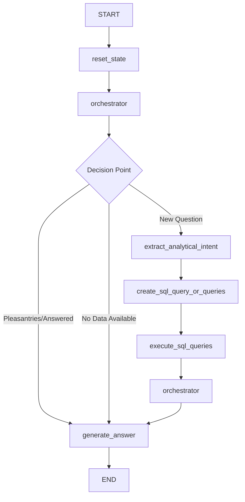

# Technical Documentation Detailed - db_agent_v1

## Project Overview

**db_agent_v1** is a GenAI Data Copilot that transforms natural language queries into SQL and provides instant database insights. It's an intelligent database agent built using LangChain and LangGraph that enables non-technical users to query enterprise databases through conversational English.

## Architecture Overview

### System Components Diagram

```
┌─────────────────────────────────────────────────────────────────┐
│                        db_agent_v1 System                      │
├─────────────────────────────────────────────────────────────────┤
│  ┌─────────────────┐    ┌─────────────────┐    ┌──────────────┐  │
│  │  Streamlit UI   │    │   Core Agent    │    │   Database   │  │
│  │ (streamlit_demo │────│  (db_agent_v1   │────│   Layer      │  │
│  │     .py)        │    │      .py)       │    │              │  │
│  └─────────────────┘    └─────────────────┘    └──────────────┘  │
│           │                       │                       │      │
│  ┌─────────────────┐    ┌─────────────────┐    ┌──────────────┐  │
│  │   Progress      │    │   LangGraph     │    │ Data         │  │
│  │   Tracking      │    │   Workflow      │    │ Generation   │  │
│  │                 │    │                 │    │ Scripts      │  │
│  └─────────────────┘    └─────────────────┘    └──────────────┘  │
└─────────────────────────────────────────────────────────────────┘
```

### LangGraph Agent Workflow



### Core Dependencies Diagram

```
┌──────────────────────────────────────────────────────────────────┐
│                    External Dependencies                        │
├──────────────────────────────────────────────────────────────────┤
│  OpenAI API ── LangChain ── LangGraph ── LangSmith ── SQLAlchemy │
│      │            │           │            │           │        │
│   GPT-4.1       Tools     Workflow     Tracing    Database      │
│   GPT-4o        Agents    Engine       Monitoring   ORM         │
│                                                                  │
│  ┌─────────────┐  ┌─────────────┐  ┌─────────────┐              │
│  │   Streamlit │  │   sqlglot   │  │   psycopg2  │              │
│  │   Web UI    │  │ SQL Parser  │  │ PostgreSQL  │              │
│  └─────────────┘  └─────────────┘  └─────────────┘              │
└──────────────────────────────────────────────────────────────────┘
```

## Core Module Documentation

### 1. Main Agent Module (db_agent_v1.py)

#### State Management

```python
class State(TypedDict):
    """
    Central state management for the agent workflow.
    Maintains all necessary context throughout the conversation.
    """
    objects_documentation: str        # Database schema information
    database_content: str            # Database content summary  
    sql_dialect: str                 # Target SQL dialect (SQLite)
    messages_log: Sequence[BaseMessage]  # Conversation history
    intermediate_steps: list[AgentAction]  # Agent processing steps
    analytical_intent: list[str]      # Extracted analytical requirements
    current_question: str            # Current user query
    current_sql_queries: list[dict]  # Generated SQL queries and results
    generate_answer_details: dict    # Answer generation metadata
    llm_answer: BaseMessage          # Final AI response
```

#### Core Agent Tools

##### 1. Analytical Intent Extraction

```python
@tool
def extract_analytical_intent(state: State):
    '''
    Generates a natural language description to capture the analytical 
    intent and refine the user ask.
    
    Process:
    1. Determines if question is clear or ambiguous using LLM
    2. If clear: creates analytical intents for SQL generation
    3. If ambiguous: creates multiple analytical intents with explanatory notes
    
    Returns:
        Updated state with analytical_intent and generate_answer_details
    '''
```

**Dependencies:**
- `OpenAI GPT-4.1` for complex analytical reasoning
- `LangChain StructuredOutputParser` for response formatting
- Database schema documentation for context

**Function Flow:**
```
User Question → Ambiguity Detection → Clear/Ambiguous Branch
    │                                       │
    ├─ Clear: Single Analytical Intent      │
    └─ Ambiguous: Multiple Analytical Intents + Explanations
```

##### 2. SQL Query Generation

```python
@tool  
def create_sql_query_or_queries(state: State):
    """
    Creates SQL query/queries to answer a question based on 
    documentation of tables and columns available.
    
    Features:
    - Supports both simple and multi-step analytical intents using CTEs
    - Validates queries against database schema
    - Handles complex analytical requirements with sequential queries
    
    Updates:
        state['current_sql_queries'] with query objects containing:
        - query: raw SQL string
        - explanation, result, insight, metadata: populated later
    """
```

**Dependencies:**
- `OpenAI GPT-4.1` for complex SQL generation
- Database schema documentation
- `sqlglot` for SQL validation and parsing

**Query Complexity Support:**
- **Simple Queries**: Single table filtering and aggregation
- **Multi-step Analysis**: CTE-based complex analytical workflows
- **Root Cause Analysis**: Temporal and comparative analysis
- **Trend Analysis**: Time-series aggregations with window functions

##### 3. Answer Generation

```python
@tool
def generate_answer(state: State):
    """
    Generates the AI answer taking into consideration the explanation 
    and the result of the SQL query that was executed.
    
    Scenario-based answer generation:
    - Scenario A: Data-driven insights from SQL results
    - Scenario B: Conversational responses from history
    - Scenario C: Data not available responses with alternatives
    - Scenario D: Ambiguous question clarification
    """
```

**Scenario Decision Matrix:**
```
┌─────────────────┬─────────────────┬──────────────────┐
│   User Input    │   Data Status   │     Scenario     │
├─────────────────┼─────────────────┼──────────────────┤
│ Analytical Q    │ Data Available  │ A: Data Insights │
│ Pleasantries    │ Any             │ B: Conversation  │
│ Analytical Q    │ No Data         │ C: Alternatives  │
│ Unclear Q       │ Any             │ D: Clarification │
└─────────────────┴─────────────────┴──────────────────┘
```

#### SQL Processing Functions

##### Query Execution with Error Handling

```python
def execute_sql_query(state: State):
    """
    Executes the SQL query and retrieves the result.
    
    Features:
    - Automatic error correction (up to 3 attempts)
    - Token limit checking and query refinement
    - Query metadata extraction using sqlglot
    - Performance monitoring and logging
    
    Error Handling:
    1. Syntax Error Detection → automatic correction
    2. Token Limit Exceeded → query refinement with aggregation
    3. Schema Violations → query rewriting
    """
```

**Error Recovery Flow:**
```
SQL Query → Execute → Success ✓
    │           │
    │           └─ Error → Classify Error Type
    │                          │
    │                          ├─ Syntax → correct_syntax_sql_query()
    │                          ├─ Token Limit → refine_sql_query() 
    │                          └─ Schema → rewrite_query()
    │
    └─ Retry (max 3 attempts)
```

##### Memory Management

```python
def manage_memory_chat_history(state: State):
    """
    Manages the chat history so that it does not become too large 
    in terms of output tokens.
    
    Strategy:
    - Token limit: 1000 tokens for chat history
    - Keeps last 4 pairs of human prompts and AI responses
    - Summarizes older messages to preserve context
    - SQL query log limit: 20 entries with automatic cleanup
    
    Memory Optimization:
    1. Token counting using tiktoken (gpt-4o encoding)
    2. Intelligent summarization of older conversations
    3. Critical context preservation for recent interactions
    """
```

#### Advanced Features

##### Query Metadata Extraction

```python
def extract_metadata_from_sql_query(sql_query):
    """
    Parses SQL using sqlglot to extract structural information.
    
    Returns:
        dict: {
            'tables': [list of table names],
            'filters': [list of WHERE conditions],
            'aggregations': [list of aggregation functions],
            'groupings': [list of GROUP BY columns]
        }
    
    Usage:
    - Query explanation generation
    - Performance analysis
    - Schema validation
    - User education about query structure
    """
```

**SQL Parsing Pipeline:**
```
SQL Query → sqlglot.parse() → AST Analysis → Metadata Extraction
    │             │                │              │
    │             │                │              ├─ Tables Used
    │             │                │              ├─ Filters Applied
    │             │                │              ├─ Aggregations
    │             │                │              └─ Groupings
    │             │                │
    │             │                └─ Error Handling for Complex Queries
    │             └─ Dialect-specific parsing (SQLite, PostgreSQL, etc.)
    └─ Input validation and sanitization
```

### 2. Streamlit Web Interface (streamlit_demo.py)

#### Database Management

```python
@st.cache_resource
def download_database():
    """
    Download database from GitHub releases if it doesn't exist.
    
    Features:
    - Multi-path database location checking
    - Automatic download from GitHub releases with progress tracking
    - Version management and caching
    - Error handling for network issues
    
    Returns:
        str: Path to database file
    
    Search Locations:
    1. Current directory
    2. Parent directory  
    3. Root project directory
    4. Streamlit Cloud deployment paths
    """
```

#### Real-time Progress Tracking

**Progress Queue Integration:**
```python
# Progress tracking system for agent execution
progress_queue = queue.Queue()

def update_progress(message: str):
    """Add progress message to queue for real-time UI updates"""
    progress_queue.put(message)

# UI Integration
while not progress_queue.empty():
    progress_message = progress_queue.get()
    st.write(f"🔄 {progress_message}")
```

**UI Component Hierarchy:**
```
Streamlit App
├── Sidebar
│   ├── Database Status Display
│   ├── Connection Information  
│   └── System Health Metrics
├── Main Chat Interface
│   ├── Message History Display
│   ├── Real-time Progress Updates
│   ├── SQL Query Visualization
│   └── Result Tables/Charts
└── Input Components
    ├── Text Input for Questions
    ├── Example Questions Buttons
    └── Clear History Option
```

### 3. Database Schema and Initialization

#### PostgreSQL Metadata Manager (update_objects_metadata_demo_db.py)

```python
class PostgresMetadataManager:
    """
    Get/Update tables metadata stored in PostgreSQL using psycopg2.
    
    Capabilities:
    - Table and column comment management
    - Bulk metadata operations
    - Relationship mapping
    - Custom query execution for column values
    - Comprehensive metadata reference table creation
    """
    
    def __init__(self, connection_string: str):
        """
        Initialize with PostgreSQL connection string.
        Sets up logging configuration and connection management.
        """
```

##### Key Methods

**Metadata Retrieval:**
```python
def get_table_metadata(self, schema: str, table: str, columns: Optional[List[str]] = None):
    """
    Get table and column metadata from PostgreSQL information schema.
    
    Process:
    1. Query pg_tables for table comments via obj_description()
    2. Query information_schema.columns for column metadata
    3. Join with pg_class and pg_namespace for complete information
    4. Build comprehensive metadata structure
    
    Returns:
        List[Dict]: Table and column metadata with comments
    """
```

**Bulk Operations:**
```python
def bulk_update_metadata(self, metadata_updates: List[Dict]):
    """
    Bulk update metadata for multiple tables and columns.
    
    Supported Update Types:
    - 'table': Update table comments only
    - 'columns': Update column comments only  
    - 'both': Update both table and column comments
    
    Error Handling:
    - Individual operation failure isolation
    - Comprehensive result reporting
    - Transaction rollback on critical errors
    """
```

**Reference Table Creation:**
```python
def create_metadata_reference_table(self, tables: List[Dict], relationships: List[Dict]):
    """
    Create a metadata reference table with all table and column documentation.
    
    Features:
    - Comprehensive documentation storage
    - Relationship mapping between tables
    - Custom query execution for column value enumeration
    - Full-text search capabilities
    
    Schema:
    - table_schema, table_name, column_name
    - table_column_documentation (TEXT)
    - column_ordinal_position (INTEGER)
    - relationship_key1, relationship_key2 (VARCHAR)
    - column_values (TEXT) - distinct values for categorical columns
    """
```

#### Data Generation Pipeline

The data generation system creates realistic demo data across multiple dimensions:

##### Date Dimension (b_create_date.py)

```python
class DateDimensionGenerator:
    """
    Generate comprehensive date dimension data for time-series analysis.
    
    Coverage:
    - Date range: last 10 years + next 2 years from current date
    - Granularity: Daily level with all standard date attributes
    - Business Logic: Weekend flags, quarter calculations, month boundaries
    """
    
    def generate_date_dimension_data(self) -> List[Dict[str, Any]]:
        """
        Generate date dimension data according to schema specifications.
        
        Attributes Generated:
        - calendar_day (PRIMARY KEY)
        - month_name, month, day_of_month
        - month_start_date, month_end_date
        - quarter, quarter_name, quarter_start_date, quarter_end_date  
        - year, is_weekend
        
        Validation:
        - Date range coverage verification
        - Leap year handling
        - Weekend/weekday distribution validation
        """
```

##### Advisor Data Generation (c_create_advisors.py)

```python
class AdvisorDataGenerator:
    """
    Generate realistic advisor data with SCD Type 2 historical tracking.
    
    Target: 50 advisors with weighted distributions
    SCD Type 2 Features:
    - from_date, to_date for version tracking
    - Termination processing with historical records
    - Business rule validation
    """
    
    def generate_advisor_data(self) -> List[Dict[str, Any]]:
        """
        Two-phase advisor data generation:
        
        Phase 1: Generate initial active advisor records
        - Weighted distribution across firm affiliation models
        - Realistic tenure and role assignments
        - Practice segment classification
        
        Phase 2: Process terminations creating SCD2 history
        - 10% termination probability for recent records
        - Proper SCD2 version management
        - Business continuity validation
        """
```

**Distribution Models:**
```python
# Firm Affiliation Model Weights
FIRM_AFFILIATION_WEIGHTS = {
    'RIA': 0.30,                    # 30%
    'Hybrid RIA': 0.25,             # 25%
    'Independent BD': 0.20,         # 20%
    'Broker-Dealer W-2': 0.10,      # 10%
    'Wirehouse': 0.08,              # 8%
    'Bank/Trust': 0.05,             # 5%
    'Insurance BD': 0.02            # 2%
}

# Practice Segment Distribution
PRACTICE_SEGMENT_WEIGHTS = {
    'Solo Practice': 0.40,          # 40%
    'Small Team': 0.35,             # 35%
    'Ensemble': 0.20,               # 20%
    'Enterprise': 0.05              # 5%
}
```

### 4. Function Dependencies and Interaction Patterns

#### Core Agent Function Dependencies

```
extract_analytical_intent()
├── Depends On:
│   ├── OpenAI GPT-4.1 API
│   ├── Database schema (state.objects_documentation)
│   ├── LangChain StructuredOutputParser
│   └── User question (state.current_question)
├── Updates:
│   ├── state.analytical_intent
│   └── state.generate_answer_details
└── Used By:
    └── orchestrator() → routing logic

create_sql_query_or_queries()
├── Depends On:
│   ├── state.analytical_intent (from extract_analytical_intent)
│   ├── Database schema documentation
│   ├── OpenAI GPT-4.1 for complex SQL generation
│   └── sqlglot for SQL validation
├── Updates:
│   └── state.current_sql_queries
└── Triggers:
    └── execute_sql_query() → automatic execution

execute_sql_query()
├── Depends On:
│   ├── state.current_sql_queries
│   ├── Database connection (get_database_connection)
│   ├── sqlglot for metadata extraction
│   └── tiktoken for token counting
├── Updates:
│   ├── Query results in state.current_sql_queries
│   ├── Query metadata and analysis
│   └── Error information if applicable
└── Triggers:
    ├── correct_syntax_sql_query() → on syntax errors
    ├── refine_sql_query() → on token limit exceeded
    └── create_query_analysis() → for insights generation

generate_answer()
├── Depends On:
│   ├── state.current_sql_queries (with results)
│   ├── state.generate_answer_details
│   ├── state.messages_log (for context)
│   └── OpenAI GPT-4o for answer generation
├── Updates:
│   └── state.llm_answer (final response)
└── Scenarios:
    ├── Scenario A: Data-driven insights
    ├── Scenario B: Conversational responses
    ├── Scenario C: Data not available
    └── Scenario D: Ambiguous question clarification
```

#### Database Integration Dependencies

```
PostgresMetadataManager
├── Direct Dependencies:
│   ├── psycopg2 (PostgreSQL connectivity)
│   ├── logging (for operation tracking)
│   └── contextlib (connection management)
├── Methods Chain:
│   ├── get_table_metadata() → extract_metadata_from_db()
│   ├── update_table_metadata() → PostgreSQL COMMENT commands
│   ├── bulk_update_metadata() → batch operations
│   └── create_metadata_reference_table() → comprehensive documentation
└── Integration Points:
    ├── Main agent via state.objects_documentation
    ├── Streamlit UI for metadata display
    └── Data generation scripts for validation

Data Generation Pipeline
├── Base Dependencies:
│   ├── psycopg2 (database connectivity)
│   ├── pandas (data manipulation)
│   ├── numpy (statistical distributions)
│   └── datetime (date calculations)
├── Generation Order (dependencies):
│   1. DateDimensionGenerator (no dependencies)
│   2. BusinessLineGenerator (no dependencies)
│   3. AdvisorDataGenerator (references date table)
│   4. HouseholdGenerator (references advisors, date)
│   5. AccountGenerator (references advisors, household, business_line)
│   6. FactGenerators (reference all dimension tables)
└── Validation Chain:
    ├── Data integrity checks after each generation
    ├── Referential integrity validation
    └── Business rule compliance verification
```

#### External API Dependencies

```
OpenAI API Integration
├── Models Used:
│   ├── GPT-4.1 (gpt-4-1106-preview)
│   │   ├── Complex analytical reasoning
│   │   ├── Multi-step SQL generation
│   │   └── Ambiguity detection
│   └── GPT-4o (gpt-4o)
│       ├── Fast answer generation
│       ├── Query explanations
│       └── Conversational responses
├── LangChain Integration:
│   ├── ChatOpenAI wrapper for API calls
│   ├── StructuredOutputParser for response formatting
│   ├── Tool integration with @tool decorator
│   └── Message handling with BaseMessage types
└── Error Handling:
    ├── API rate limit management
    ├── Token limit monitoring
    ├── Fallback model selection
    └── Network error recovery

LangSmith Tracing
├── Configuration:
│   ├── Project: "db_agent_v1"
│   ├── Session tracking with thread_id
│   └── Custom run names for operations
├── Traced Operations:
│   ├── Agent tool executions
│   ├── LLM API calls with token usage
│   ├── SQL query executions
│   └── Error occurrences and recovery
└── Benefits:
    ├── Performance monitoring
    ├── Debugging complex workflows
    ├── Usage analytics
    └── Quality assurance validation
```

## Performance and Optimization

### Token Management Strategy

```python
# Token limits and thresholds
CHAT_HISTORY_TOKEN_LIMIT = 1000      # tokens
SQL_RESULT_TOKEN_LIMIT = 500         # tokens  
MAXIMUM_CONTEXT_WINDOW = 8192        # tokens (GPT-4 limit)
QUERY_REFINEMENT_THRESHOLD = 500     # tokens (triggers query optimization)

# Memory management flow
def manage_memory_chat_history(state: State):
    """
    Memory Management Strategy:
    1. Count tokens in current chat history
    2. If > 1000 tokens:
       - Keep last 4 message pairs
       - Summarize older messages
       - Maintain conversation context
    3. Limit SQL query log to 20 entries
    """
```

### Query Optimization Techniques

**Automatic Query Refinement:**
```python
def refine_sql_query(sql_query: str, sql_result: str) -> str:
    """
    Query optimization strategies:
    1. Add LIMIT clauses for large result sets
    2. Implement aggregation instead of row-level data
    3. Use sampling for exploratory analysis
    4. Apply intelligent filtering based on data distribution
    
    Triggers:
    - Result size > 500 tokens
    - Execution time > 5 seconds
    - Memory usage concerns
    """
```

**Error Recovery Pipeline:**
```
SQL Execution Error
├── Syntax Error
│   ├── Extract error message
│   ├── Apply common fixes (quote issues, reserved words)
│   ├── Regenerate query with corrections
│   └── Retry (max 3 attempts)
├── Token Limit Exceeded  
│   ├── Analyze query complexity
│   ├── Apply aggregation strategies
│   ├── Add sampling or filtering
│   └── Re-execute optimized query
└── Schema Violations
    ├── Validate against current schema
    ├── Suggest alternative approaches
    ├── Update query with valid table/column names
    └── Provide user feedback
```

## Security and Data Protection

### Input Sanitization

```python
# SQL Injection Prevention
def sanitize_user_input(user_question: str) -> str:
    """
    Input sanitization strategy:
    1. Remove or escape SQL keywords in user input
    2. Validate against schema documentation only
    3. Use parameterized queries where possible
    4. Log suspicious input patterns
    """

# Query Validation
def validate_generated_sql(sql_query: str, allowed_operations: List[str]) -> bool:
    """
    SQL validation rules:
    1. Allow only SELECT statements (no INSERT/UPDATE/DELETE)
    2. Validate table names against known schema
    3. Check for dangerous functions or operations
    4. Limit query complexity and nested levels
    """
```

### Connection Security

```python
# Database Connection Management
@contextmanager
def get_connection():
    """
    Secure connection handling:
    1. Connection pooling for performance
    2. Automatic connection cleanup
    3. Timeout management
    4. SSL/TLS encryption when available
    """

# Environment Variable Management
connection_string = os.getenv('CONNECTION_STRING_DB')
if not connection_string:
    raise ValueError("CONNECTION_STRING_DB environment variable is required")
```

## Deployment and Scalability

### Streamlit Cloud Deployment

```python
# Cloud-specific optimizations
@st.cache_resource
def download_database():
    """
    Cloud deployment considerations:
    1. Persistent storage management
    2. Database file caching across sessions  
    3. Network-based database downloads
    4. Version control for database updates
    """

# Session state management
if 'thread_id' not in st.session_state:
    st.session_state.thread_id = str(uuid.uuid4())
```

### Enterprise Integration Points

```python
# Multi-database support
DATABASE_DIALECTS = {
    'sqlite': SQLiteDialect,
    'postgresql': PostgreSQLDialect, 
    'snowflake': SnowflakeDialect,
    'databricks': DatabricksDialect
}

# Extensible architecture
class DatabaseAdapter:
    """
    Abstract base class for database integrations:
    1. Connection management
    2. Dialect-specific SQL generation
    3. Schema introspection
    4. Performance optimization
    """
```

### Monitoring and Observability

```python
# LangSmith Integration
def create_config(run_name: str, is_new_thread_id: bool = False, thread_id: str = None):
    """
    Observability configuration:
    1. Distributed tracing across agent operations
    2. Performance metrics collection
    3. Error tracking and alerting
    4. Usage analytics and optimization insights
    
    Metrics Tracked:
    - Query execution time
    - Token usage per operation
    - Error rates and types
    - User interaction patterns
    """
```

## Conclusion

The db_agent_v1 system represents a sophisticated implementation of a conversational database interface that bridges the gap between natural language and SQL. Through its modular architecture, comprehensive error handling, and intelligent query optimization, it provides enterprise-grade database access capabilities while maintaining simplicity for end users.

The system's strength lies in its:
- **Robust error handling and recovery mechanisms**
- **Intelligent memory management and optimization**
- **Comprehensive metadata management capabilities**
- **Scalable architecture supporting multiple database platforms**
- **Real-time monitoring and observability features**

This technical documentation provides the foundation for understanding, maintaining, and extending the db_agent_v1 system for production enterprise deployments.